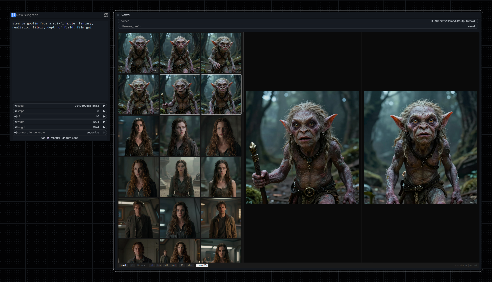
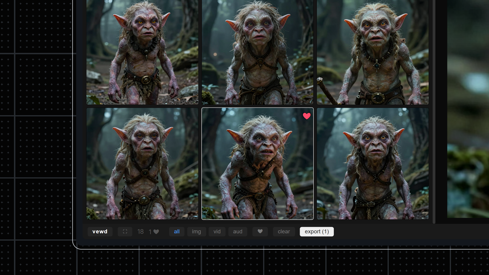
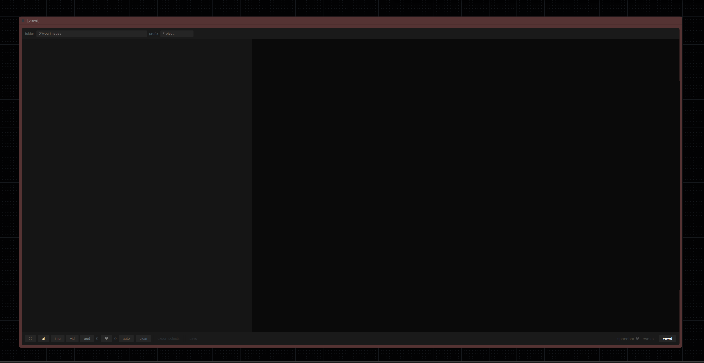

# vewd

A media viewer node for ComfyUI. Auto-captures all generated media into a grid for easy viewing, sorting, and comparing.



## Why Vewd?

**Reduce waste, save only what you want, where you want.** Instead of saving hundreds of images to your hard drive and sorting through them later, Vewd lets you review generations in real-time, heart your favorites, and export only your selects.

## Features

- **No wires** - No connections to nodes are needed. Vewd automatically captures all media produced by the workflow
- **All media types** - Images, videos, and audio
- **Grid view** - See all generations in a thumbnail grid
- **Preview & compare** - Click to preview, select two to compare side-by-side
- **Heart favorites** - Use spacebar to make selects of your favorites (Like Filter)
- **Media filters** - Filter by All, Images, Videos, or Audio
- **Export selects** - Export hearted media with custom filename prefix (adds to selects sub-folder)
- **Fullscreen** - Expand to fullscreen for better viewing
- **Non-destructive** - Delete only removes from viewer, not your files



*Clean and minimal UI design — no wires necessary*



## Installation

### Via Git

```bash
cd ComfyUI/custom_nodes
git clone https://github.com/spiritform/vewd.git
```

Restart ComfyUI.

### Manual

Download and extract to `ComfyUI/custom_nodes/vewd/`

## Usage

1. Add the **Vewd** node to your workflow (found in `image` category)
2. Run your workflow - media automatically appears in the grid
3. Click to preview, Ctrl+click or Shift+click to select multiple
4. Space to heart favorites
5. Click **Export** to save hearted media

**No wiring needed** - Vewd captures everything automatically via remote connection to all nodes.

## Keyboard Shortcuts

| Key | Action |
|-----|--------|
| ← → ↑ ↓ | Navigate grid |
| Spacebar | Heart/unheart |
| Delete | Remove from viewer |
| Esc | Exit fullscreen |

## Standalone Viewer

Vewd can also be used as a standalone image viewer outside of ComfyUI. Run `vewd.bat` (or `python viewer.py [folder]`) to launch a local browser-based viewer for any folder of images.

```bash
vewd.bat
# or
python viewer.py path/to/images
```

## Node Settings

- **folder** - Where to export hearted media (creates `/selects` subfolder)
- **filename_prefix** - Prefix for exported files (e.g., `myproject_001.png`)

## License

MIT
