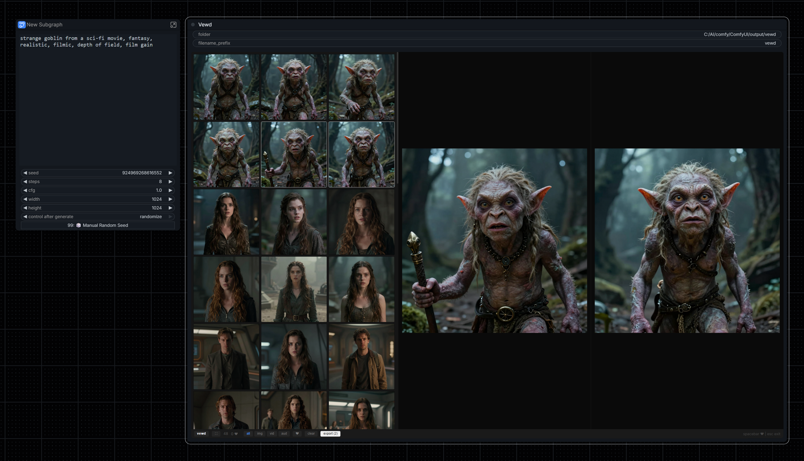
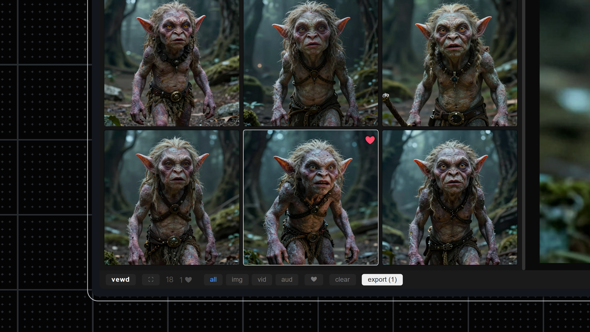
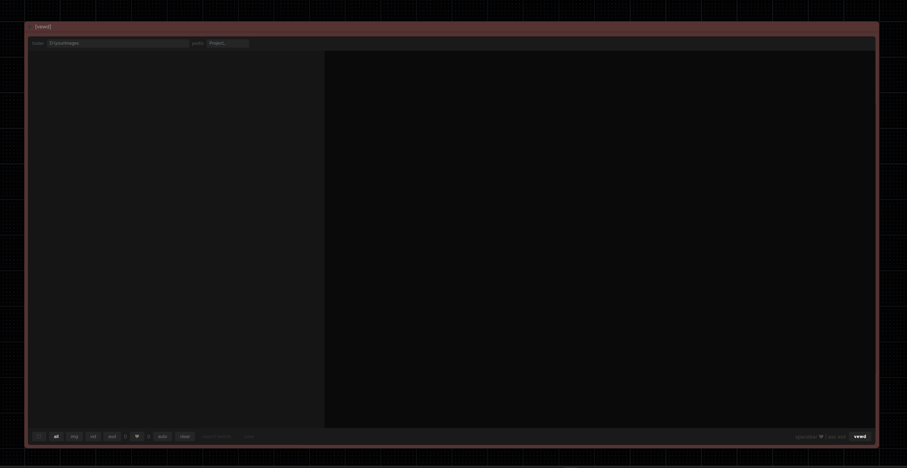

# vewd

A media viewer for reviewing, comparing, and selecting images. Works on Mac and PC. Use it as a **standalone app** with any folder of images, or as a **ComfyUI node** that auto-captures generations.



## Why Vewd?

**Reduce waste, save only what you want.** Instead of saving hundreds of images and sorting through them later, Vewd lets you review in real-time, heart your favorites, and export only your selects.

## Features

- **Grid + preview** - Thumbnail grid with side-by-side preview and compare
- **Heart favorites** - Spacebar to heart, filter to show only selects
- **All media types** - Images, videos, audio, 3D models (.glb, .obj), and Gaussian splats (.ply, .splat)
- **3D viewer** - Interactive orbit/zoom preview for 3D models and Gaussian splats
- **Import & drag-drop** - Drag files from explorer or images from browsers, or use the import button
- **IMAGE/VIDEO output** - Pass selected media to downstream nodes
- **Media filters** - Filter by all, images, videos, audio, or 3D
- **Export selects** - Export hearted media to a `selects/` subfolder
- **Non-destructive** - Delete only removes from viewer, not your files



*Completely wireless clean and minimal UI design*



## ComfyUI Node

### Installation

#### Via Git

```bash
cd ComfyUI/custom_nodes
git clone https://github.com/spiritform/vewd.git
```

Restart ComfyUI.

#### Manual

Download and extract to `ComfyUI/custom_nodes/vewd/`

### Usage

1. Add the **Vewd** node to your workflow (found in `image` category)
2. Run your workflow - media automatically appears in the grid (images, videos, audio, 3D models, splats)
3. Click to preview, Ctrl+click or Shift+click to select multiple
4. Space to heart favorites
5. Click **export selects** to save hearted media

**No wiring needed** - Vewd captures everything automatically.

### Node Settings

- **folder** - Where to export hearted media (creates `/selects` subfolder)
- **filename_prefix** - Prefix for exported files (e.g., `myproject_001.png`)

## Keyboard Shortcuts

| Key | Action |
|-----|--------|
| ← → ↑ ↓ | Navigate grid |
| Spacebar | Heart/unheart |
| Delete | Remove from viewer |
| Esc | Exit fullscreen |

## Standalone App

No ComfyUI required. Just Python.

```bash
# Windows
vewd.bat

# Mac / Linux
chmod +x vewd.sh
./vewd.sh

# or directly
python viewer.py path/to/images
```

Point it at any folder of images, videos, or audio. Opens a browser-based viewer to review, heart, compare, and export your selects.


## What's New

### v1.8.0 — Cloud Compatibility & Batch Output

- **Cloud support** — Auto-detects cloud vs local at runtime. One version works everywhere
- **Batch IMAGE output** — Select multiple images (Ctrl/Shift+click), queue workflow, all selected frames output as a batch tensor. Wire to Video Combine for GIF/MP4 compilation
- **Browser download** — New download button for saving media via browser dialog (works on both local and cloud)
- **Client-side waveforms** — Audio waveform thumbnails now generated via Web Audio API instead of server-side ffmpeg
- **GIF display** — Animated GIFs display as native `` tags (auto-loop) with play icon badge
- **UI refresh** — Brighter text, renamed save to export, cleaner bottom bar

### v1.5.0 — Audio Player & Waveforms

- **Waveform thumbnails** — Audio files show colored waveform in the grid instead of a plain icon
- **Custom audio player** — Full-width waveform with click-to-seek, playhead, and play/pause controls
- **Save as MP3** — FLAC/WAV/OGG/AAC automatically converted to MP3 via ffmpeg on save/export
- **Resilient restore** — Rebuilt URLs on refresh with fallback if files moved between temp/output
- **New captures don't steal focus** — Grid stays on your current selection while new items come in

### v1.4.3 — Capture Fix

- **Fixed auto-capture** — Generated images from workflow now correctly appear in the Vewd grid again

### v1.4.2 — IMAGE Output & Splat Camera Lock

- **IMAGE output works like LoadImage** — Selected image loaded directly from disk, reliable with all downstream nodes
- **Splat camera lock** — Lock/Unlock toggle freezes the splat view; camera state saved and restored on re-select
- **Pre-queue sync** — Image/video info sent to backend before every workflow run, survives restarts
- **Node ID fix** — Fixed `node.id` not being set at widget creation time (was `-1`)

### v1.4.0 — Gaussian Splat Support & Import

- **Gaussian splat viewer** — Interactive `.ply` and `.splat` preview with orbit/zoom controls
- **Smart splat capture** — Auto-captures PLY output from nodes like PlyPreview with camera extrinsics/intrinsics
- **Import & drag-drop** — Drag files from Windows explorer or images from browsers (Pinterest, Google Images) directly into the viewer
- **Import button** — File picker for importing external reference images and videos
- **Filter-aware delete** — Deleting items while filtered now selects the next visible item instead of jumping to a hidden one
- **IMAGE output** — Selected image passed to downstream nodes (loaded from disk like LoadImage)
- **VIDEO output** — Full video file info passed to downstream nodes for frame extraction

### v1.1.0 — 3D Model Support
- **3D capture** — Auto-captures `.glb` and `.obj` output from nodes like Hunyuan3D
- **Interactive preview** — Orbit, zoom, and auto-rotate 3D models directly in the preview pane
- **Smart thumbnails** — Grid shows the source image used for generation with a 🧊 badge
- **3D filter** — New filter button to show only 3D models
- **Save support** — Save 3D files with original format preserved

### v1.0.4
- Seed tracing from dependency graph
- ComfyUI Registry support

### v1.0.3
- Consolidated save button with S hotkey
- Side-by-side compare with pane selection

## License

MIT
